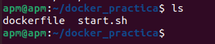
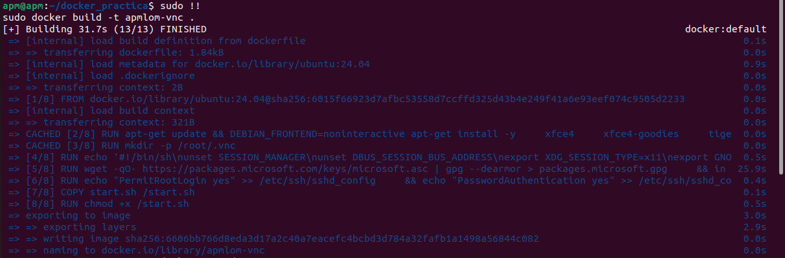
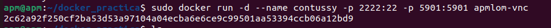
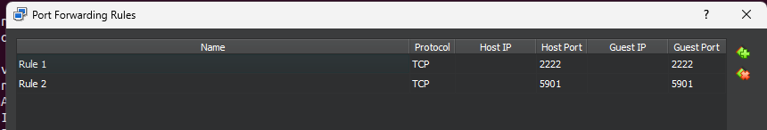
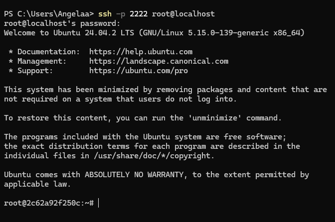
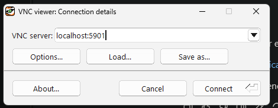

## Crear un directori a la MV per a treballar, en aquesta carpeta tindrem els arxius dockefile i start.sh:
Exemple:
```bash
mkdir practica_2
```


En aquesta carpeta, executem la comanda:
```bash
docker build -t {nom que vulguis posarli a la imatge} .
```



Ara executa aquesta comanda per iniciar el contenidor:
```bash
docker run -d --name {nom que vulguis posarli al contenidor} -p 2222:22 -p 5901:5901 {nom que has escollit abans}
```

  

Per accedir per SSH I VNC  desde fora de la MV, fem redireccionament de ports. 
```bash
ssh -p 2222 root@localhost
```


Després executem la comanda ssh des de la shell de la màquina física:



Hem descarregat TigerVNC per fer la pràctica, un cop instal·lat, podem accedir al contenidor posant:
```
localhost:5901
```


Ja hi som dins! Ara mirem que python està instal·lat amb la comanda:
```bash
python3
```
Per últim, VSC:

